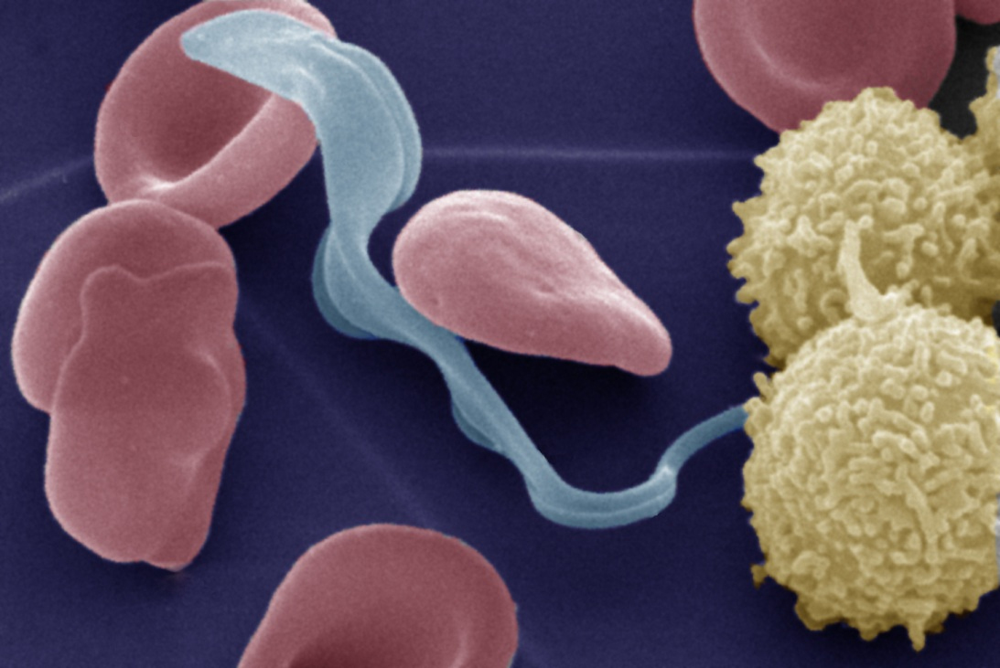
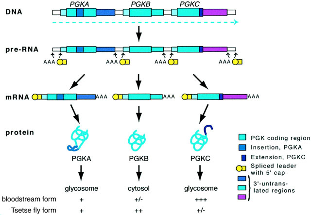
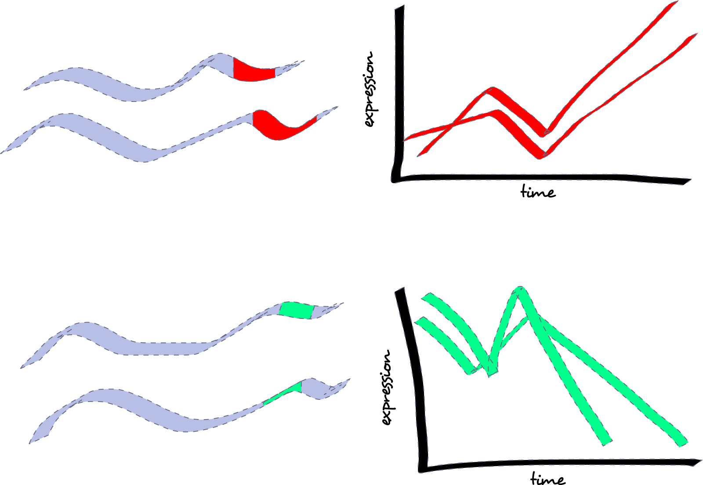
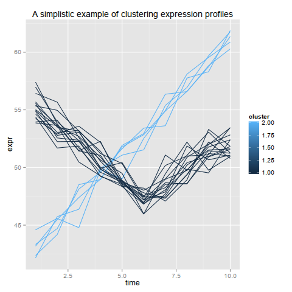
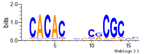
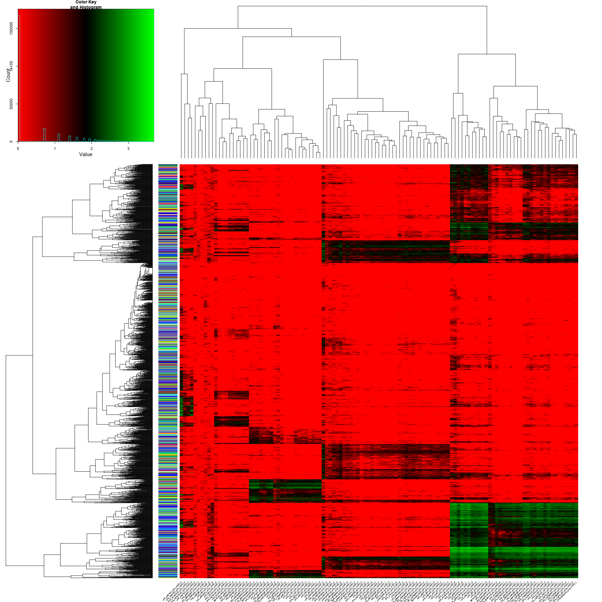

An EXTREME Approach to Motif Detection
======================================

<a href='mailto:khughitt@umd.edu'>Keith Hughitt</a> (<time>2014-09-29</time>)

[view source]()

Introduction
------------

### Overview

The purpose of this guide is to share some of my experience using one of the
[numerous](http://www.biologydirect.com/content/1/1/11) motif detection tools
available, [EXTREME](https://github.com/uci-cbcl/EXTREME).

In addition to describing some basic tips for working with EXTREME itself, I
will provide some examples of how I was able to incorporate it into a (still
developing) pipeline for detecting motifs in the 5' and 3'UTRs of a collection
of co-expressed genes.

But first, some motivation...

### Background


(source: [Deutsches Elektronen-Synchrotron](http://www.desy.de/information__services/press/pressreleases/2012/pr_291112/index_eng.html))

[*Trypanosomatids*](http://en.wikipedia.org/wiki/Trypanosomatid) are an order
of single-cell eukaryotic parasites, a number of which cause lots of problems
for *H. sapiens*. Some of the more well-known members of the group include *T.
brucei* (pictured above, causitive agent of [sleeping
sickness](http://en.wikipedia.org/wiki/African_trypanosomiasis)), *T. cruzi*
(causitive agent of [Chagas disease](http://en.wikipedia.org/wiki/Chagas_disease)) and *Leishmania major*
(causitive agent of [Leishmaniasis](http://en.wikipedia.org/wiki/Leishmaniasis)).

There is much that is still unknown about these early-branching eukaryotes. The
characteristic that relates to today's discussion, however, is the their
regulation of transcription.

Instead of transcribing genes individually, thus allowing control of expression
levels of inidivual genes, trypanosome genomes include long strings of
similar-stranded genes (polycistronic transcriptional units, or PTUs) which are
transcribed together. The polycistronic mRNAs are then simultaneously
trans-spliced and polyadenylated, resulting in individual processed mRNAs.


(Clayton, 2002)

Rather than regulating expression at the transcriptional level, it is believed
that most of the regulation occurs at the post-transcriptional level. One
possible scenario (the current favored hypothesis) is that the regulation
occurs via binding of RNA binding proteins in the (primary 3'-) UTRs of genes,
impacting, perhaps, stability or translational efficiency. The problem is,
that, while there has been some evidence for this, no one has been able to
precisely describe the regulation of large numbers of genes via this
mechanism in any of the Trypanosomes.

If the mechanism of regulation is via RNA binding binding in the 3'UTRs, then
their should be some signal(s) being bound.



A number of people have looked for them (including our lab), but so far the
results are still not completely satisfying.

Can we do better?

Methods
-------

The basic approach one might use to answer this question is to cluster genes by
their expression profiles, and then scan the UTRs of each cluster for common
(enriched) motifs.

### EXTREME

- Recent tool for motif detection by Quang and Xie (2014)
- Based on [MEME](http://meme.nbcr.net/meme/) (Bailey & Elkan, 1994), but uses
    an *online* [Expectation Maximization (EM)](http://en.wikipedia.org/wiki/Expectation%E2%80%93maximization_algorithm)
  algorithm instead of vanilla EM.
- Intended for us with ChIP-Seq and DNase-Seq data.
- Enables the detection of motifs from much larger datasets than previously
possible with approaches like MEME.
- Written in Python, but uses some Java and Perl programs as well. Available at:
  https://github.com/uci-cbcl/EXTREME

### Example data

For demonstration purposes, I have included a sets of sequences corresponding
(roughly) to the 3'UTRs of one cluster of co-expressed genes in *L. major*. The
sequences were extracted from the *L. major Friedlin* genome ([TriTrypDB
release 8.0](http://tritrypdb.org/common/downloads/release-8.0/LmajorFriedlin/fasta/data/)).

The file is located in the `input/` directory and has the creative filename,
`cluster1.fasta`.

I will save the discussion on the clustering approach for another day, but,
given a set of expression profiles your species of interest, you could achieve
some basic clustering using something like kmeans clustering, e.g.:

```r
library(reshape2)
library(ggplot2)

# Fake data (don't try this at home...)
# cluster 1
set.seed(1)

# 5 x 10
seed1 = seq(40, 58, by=2)
cluster1 = t(matrix(rep(seed1, 5), 10)) + 
             matrix(rnorm(50, mean=3, sd=1), ncol=10)

# 15 x 10
seed2 = c(seq(50, 42, by=-1.5), seq(44, 47, by=1))
cluster2 = t(matrix(rep(seed2, 15), 10)) + matrix(rnorm(150, mean=5, sd=1), ncol=10)

mat = rbind(cluster1, cluster2)

clusters = kmeans(mat, 2)

long_dat = melt(mat)
colnames(long_dat) = c('id', 'time', 'expr')
long_dat$cluster = clusters$cluster 
ggplot(long_dat, aes(time, expr, group=id, color=cluster)) + geom_line() +
ggtitle("A simplistic example of clustering expression profiles")
```



### Extracting UTR sequences in Bioconductor

If you have exact UTR sequences, you should probably use them. Bioconductor
should provide an easy way to retrieve these sequences for more common
organisms.

If you don't know the exact UTR boundaries, here is a quick way to get
sequences that are $n$ bases long on either side of a set of known CDSs:

```r
library(Biostrings)
library(rtracklayer)
library(GenomicRanges)

# source: http://tritrypdb.org/common/downloads/release-8.0/LmajorFriedlin/gff/data/
input_gff = 'TriTrypDB-8.0_LmajorFriedlin.gff'
input_fasta = 'TriTrypDB-8.0_LmajorFriedlin_Genome.fasta'

# load annotations
gff = import.gff3(input_gff)
genes = gff[gff$type == 'gene']

# load genome sequence
fasta = readDNAStringSet(input_fasta)
names(fasta) = substring(names(fasta), 0, 7) # For L. major, normalize chromosome names

# Example: 3'UTR
utr_width = 500

# For 5'UTR, use start=TRUE in call to flank()
utr3 = flank(genes, utr_width, start=FALSE)

pos_strand = utr3[as.character(strand(utr3)) == "+"]
neg_strand = utr3[as.character(strand(utr3)) == "-"]

seqs = fasta[pos_strand]
seqs = append(seqs, reverseComplement(fasta[neg_strand]))
names(seqs) = c(pos_strand$ID, neg_strand$ID)

# Save as a FASTA file
writeXStringSet(utr3, 'out.fasta')
```

### Using EXTREME to detect motifs in the sequences

#### Parameters

See the docs on the [EXTREME github repo](https://github.com/uci-cbcl/EXTREME)
for a more detailed explanation of the parameters available at each step of the
pipeline.

##### GappedKmerSearch.py

-l HALFLENGTH Motif size (twice this + gap size) 
-ming MINGAP. Min gap size
-maxg MAXGAP. Max gap size
-minsites MINSITES. Number of exact matches required for word to become a seed.

##### run_consensus_clusering_using_wm.pl

There is one parameter-- a threshold. Don't mess with it.

##### EXTREME.py

-s SEED. Which motif seed to use; you will likely want to run `EXTREME.py` a
few times, using a different seed on each iteration.

#### Example run:

```sh
# Set path to EXTREME
EXTREME_DIR=/path/to/extreme

# Execute pipeline
python $EXTREME_DIR/src/fasta-dinucleotide-shuffle.py -f input/cluster1.fasta > input/cluster1_shuffled.fasta
python $EXTREME_DIR/src/GappedKmerSearch.py -l 5 -ming 0 -maxg 10 -minsites 4 cluster1.fasta GM12878_NRSF_ChIP_shuffled.fasta cluster1.words
perl   $EXTREME_DIR/src/run_consensus_clusering_using_wm.pl cluster1.words 0.3
python $EXTREME_DIR/src/Consensus2PWM.py cluster1.words.cluster.aln cluster1.wm

# Get three highest ranking motifs
python ../src/EXTREME.py cluster1.fasta cluster1_shuffled.fasta cluster1.wm 1
python ../src/EXTREME.py cluster1.fasta cluster1_shuffled.fasta cluster1.wm 2
python ../src/EXTREME.py cluster1.fasta cluster1_shuffled.fasta cluster1.wm 3
```

Each call to `EXTREME.py` will produce a few files including a number of
sequence logos in a couple different formats, and a position weight matrix
(PWM) in a recent MEME version. None of the existing methods for reading PWMs
into bioconductor recognized this format so I wrote my own method to do this
(see below.)



### Filtering out repeat regions with RepeatMasker

Will discuss if time permits... or.. leave for future presentation? (Matt?)

### Reading the resulting motifs back into R

EXTREME outputs motifs using a format from a recent version of MEME. Here is a
function to read those PWMs back into R/Bioconductor:

```r
###############################################################################
#
# load_meme_pwm
# 
# Loads a MEME 4.90 formatted PWM.
#
# Keith Hughitt (khughitt@umd.edu)
#
# Creates a matrix in a format usable by the Biostrings matchPWM and countPWM
# functions.
#
# For parsing output from earlier versions of MEME, see:
# - http://cran.r-project.org/web/packages/MEET/index.html
#
###############################################################################
load_meme_pwm = function(filepath) {
    # Read file contents
    lines = readLines(filepath)

    # Matrix starts on line 14 and goes until next to last line
    MATRIX_START = 14
    MATRIX_END   = length(lines) - 1

    # Get matrix lines
    lines = lines[MATRIX_START:MATRIX_END]

    # Create matrix
    pwm = matrix(nrow=length(lines), ncol=4)

    i = 1
    for (line in lines) {
        parts = unlist(strsplit(line, '\\s'))
        pwm[i,] = as.numeric(parts[parts != ""])
        i = i + 1
    }
    colnames(pwm) = c("A", "C", "G", "T")
    return(t(pwm))
}

```

### Counting the number of motif instances in a given sequence

```r
# count motif instance in a single sequence
motif = load_meme_pwm('MEMEoutput.meme') 
num_instances = countPWM(motif, utr)

# we can also plot a sequence logo of the motif
library(seqLogo)
seqLogo(motif)
```

Results
-------

For my own work, I am particularly interested in looking for combinatorial
effects of regulatory motifs. Using EXTREME, I was able to detect and quantify
motif numbers of a bunch of motifs found in the 5'- and 3'UTRs of clusters of
co-expressed genes. Currently, I'm working on a way to use this information to
attempt to predict a gene's expression profile (cluster membership) from it's
profile of motifs. (More on this when I do RIPs in a couple months...)



Discussion
----------

- EXTREME was pretty easy to get up and running
- Provides a number of parameters to give you control over the motifs to look
  for.
- Questions/challenges:
    - How do we choose the most meaningful parameters for motif detection?
    - What other approaches have people used to detect motifs?
    - What about structural motifs? Is the allowance for a gap in the motif
        sufficient to detect many of them? Or do the approaches targetted
        particularly at secondary structure motifs do other things that EXTREME
        will miss? (probably...)

References
----------

- Timothy L. Bailey and Charles Elkan, "Fitting a mixture model by expectation
    maximization to discover motifs in biopolymers", Proceedings of the Second
    International Conference on Intelligent Systems for Molecular Biology, pp.
    28-36, AAAI Press, Menlo Park, California, 1994.
- Quang, D., & Xie, X.  (2014). EXTREME: an online EM algorithm for motif
    discovery. Bioinformatics (Oxford, England), 30(12), 1667–73.
    doi:10.1093/bioinformatics/btu093
- Clayton, C. E. (2002). Life without transcriptional control ? From fly to man
    and back again. The EMBO Journal, 21(8),
    1881–1888.
