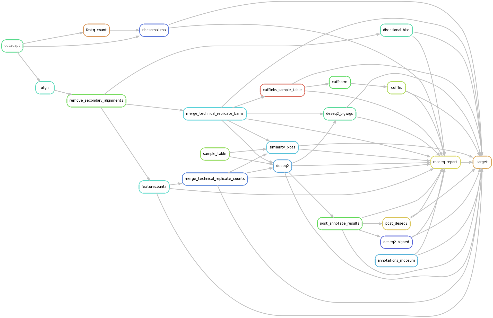

# Reproducible bioinformatics workflows with Snakemake
Author: Ryan Dale
License: Public domain

##Setup
Follow [these
instructions](https://htmlpreview.github.io/?https://bitbucket.org/johanneskoester/snakemake/raw/master/snakemake-tutorial.html) to set up your environment.

Alternatively, if you're on Mac or Linux and already have `conda` installed,
run `prepare-environment.sh` (in this directory) to download and unpack example data and create
a new conda environment.

The conda environment has snakemake, samtools, and bwa installed. To use the environment, use:

```bash
source activate snakemake-tutorial
```

which prepends directories to your `$PATH` environmental variable. When you're done, 

```bash
source deactivate
```

to restore your $PATH.

The contents of `Snakefile` are what was covered in the seminar.

##Slides
Download `slides2.html` and view the file locally.

The content for the slides is in `source.markdown`. They can be rendered using
[remark](https://github.com/gnab/remark/wiki) by running

```bash
./serve-slides.sh
```
and pointing your browser to localhost:8000.


Or read on for the same content as the slides but displayed in Github-rendered
Markdown.

---


# Reproducible bioinformatics workflows with Snakemake

Ryan Dale, PhD

Laboratory of Cellular and Developmental Biology

NIDDK, NIH

---

# What is snakemake?
[Snakemake](https://bitbucket.org/johanneskoester/snakemake) is a *workflow
management system*.

Snakemake *workflows* are essentially Python scripts plus some declarative code
that define *rules*.

Rules describe how to create output files from input files.

When your script gets too unwieldy and you think *"there must be a better way"*
then it's probably time to use a workflow management system.

---

# Example use-case: complete RNA-seq analysis

Start with FASTQ files and a config file describing experimental design
- Trim reads (`cutadapt`)
- Map to genome (`HISAT2`)
- Evaluate rRNA and directional bias (`picard`)
- Remove multimappers (`samtools`)
- Count reads in genes (`subread/FeatureCounts`)
- DE analysis (`R/Bioconductor/DESeq2`)
- Run `cufflinks` (soon `kallisto`)
- FastQC at every stage
- Aggregate QC and results into HTML reports

End with HTML reports with links to final results, plots, stats, descriptions
ready to send to collaborator.

---



---
# Other workflow management systems

 Tool          | Link
--------------:|------:
`make`   | https://www.gnu.org/software/make/
`ruffus` | http://www.ruffus.org.uk/
`Rake`   | http://docs.seattlerb.org/rake/
`luigi`  | https://github.com/spotify/luigi
`bpipe`  | http://docs.bpipe.org/
Galaxy   | https://usegalaxy.org/
`paver`  | http://paver.github.io/paver/

Most handle dependencies and only running those jobs that need updating.

Differences are in philosophy, syntax, features.

---
# Rules

A *rule* defines how to go from an input file to an output file.

Typically written in a file called `Snakefile`.

```python
rule sort:
	input: "words.txt"
	output: "sorted-words.txt"
	shell: "sort {input} > {output}"
```

Execute with:
```bash
snakemake
```

---
# Wildcards
Often we use wildcards in a rule

Ask for a file at the command line; snakemake will figure out what to do.

```python
rule sort:
    input: "{filename}"
    output: "sorted-{filename}"
    shell: "sort {input} > {output}"
```

Execute with:
```bash
snakemake sorted-words.txt
```


---
###How to think like snakemake
```bash
snakemake sorted-words.txt
```
Look in the current directory for a file called `Snakefile` and parse it.


Look for a rule whose "`output:`" matches the provided file, `sorted-words.txt`

```python
rule sort:
	input: "{filename}"
	output: "sorted-{filename}"
	shell: "sort {input} > {output}"
```

Use the discovered wildcards (here, `{filename} = words.txt`) to fill in `input`.


```python
rule sort:
	input: "words.txt"
	output: "sorted-words.txt"
	shell: "sort {input} > {output}"
```

Is `sorted-words.txt` missing? Older than `words.txt`? Run the rule, filling in
`{input}` and `{output}` as appropriate.


```bash
sort words.txt > sorted-words.txt
```

---

# Why snakemake in particular?

---

## Parallelization is trivial

runs on single machine or cluster with *no changes to code*

```bash
snakemake  # one core
```

```bash
snakemake -j8  # 8 cores
```

```bash
snakemake -j100 --cluster "qsub"  # submit up to 100 jobs at a time, PBS/SGE
```
```bash
snakemake -j100 --cluster "sbatch"  # same, but SLURM
```

---

## Bash and Python can be used interchangeably

```python
rule sort_bash:
	input: "words.txt"
	output: "sorted-words.txt"
	shell: "sort {input} > {output}"
```
```python
rule sort_python:
	input: "words.txt"
	output: "sorted-words.txt"
	run: 
        with open(str(output[0])) as fout:
            for line in sorted(open(str(input[0]))):
                fout.write(line)
```

```python
rule sort_bash_from_python:
	input: "words.txt"
	output: "sorted-words.txt"
	run:
        print("starting to sort", input[0])
        shell("sort {input} > {output}")
        print("sorted", output[0])
```
---
class: middle
# Other nice things

- Snakemake is an extension of the Python language. *Any valid Python code is
  valid Snakemake code*.

- Generate HTML reports.

- Temporary and protected files

- Create output dirs

- Diagrams showing the DAG of jobs to be run

- Tracking changes in code: you can detect when parameters changed

- Configure per-job resources (number of threads, cluster memory, etc)

- Call R via `rpy2`. (In practice, I tend to have separate scripts since `rpy2`
  can be finicky)

---

On to the [snakemake tutorial](http://htmlpreview.github.io/?https://bitbucket.org/johanneskoester/snakemake/raw/master/snakemake-tutorial.html)


